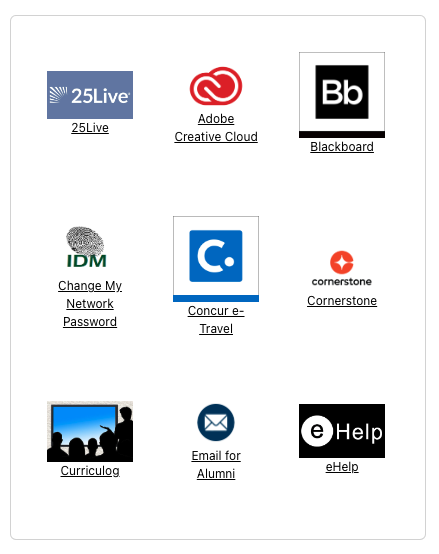
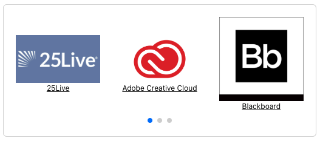

# grid-carousel

[](https://www.npmjs.com/package/@uportal/grid-carousel)
[](https://maven-badges.herokuapp.com/maven-central/org.webjars.npm/uportal__grid-carousel)
[](https://github.com/uPortal-contrib/uPortal-web-components/actions?workflow=CI)

### The Grid Carousel

A component (designed for favorites) to show icons and names of portlets in a grid view, then collapsing to a carousel in mobile view.

#### Full



#### Mobile



## Installation

```bash
# install with npm
npm install @uportal/grid-carousel

# install with yarn
yarn add @uportal/grid-carousel
```

_install with maven_

```xml
<dependency>
    <groupId>org.webjars.npm</groupId>
    <artifactId>uportal__grid-carousel</artifactId>
    <version>{version number goes here}</version>
</dependency>
```

_install with gradle_

```gradle
compile 'org.webjars.npm:uportal__grid-carousel:{version number goes here}'
```

## Usage as Web Component

```html
<script src="https://unpkg.com/@uportal/grid-carousel"></script>

<grid-carousel debug data-api-url="/portletRegistry.json">
  <p slot="zero">Nothing loaded.</p>
</grid-carousel>
```

### Options

- `data-api-url` (string): URL of the REST API that provides JSON data to the template.
  - default: `/uPortal/api/v4-3/dlm/portletRegistry.json?favorite=true`
- `oidc-url` (string): URL of the Authentication API that provides a JWT to send with the `data-api-url`
  - default: `/uPortal/api/v5-1/userinfo`
- `context-portlet-url` (string) prefixed base of links intended to go to portlet detail in uPortal.
  - default: `/uPortal/p/`
- `debug` (boolean): component will run in a standalone way (disable api call).
  - default: `false`
- `breakpoint` (number): browser width where the component will collapse to a carousel (at less than number provided)
  - default: `768`
- `default-icon` (string) default path to icon if image is not defined in json
  - default: `/ResourceServingWebapp/rs/tango/0.8.90/32x32/categories/applications-other.png`
- `truncate-length` (number) length of text to truncate to for name of portlet
  - default: `50`
- `slides-per-view` (number) number of slides to show in mobile view
  - default: `3`
- `slides-per-group` (number) number of slides to change by in mobile view
  - default: `3`
- `speed` (number) speed of transition in mobile view
  - default: `200`;
- `space-between` (number) distance between icons in mobile view
  - default: `20`

### Slot Content

The `zero` slot defines the template containing the markup that will appear on the page when the data retrieved is empty but returns a 20x status code.
