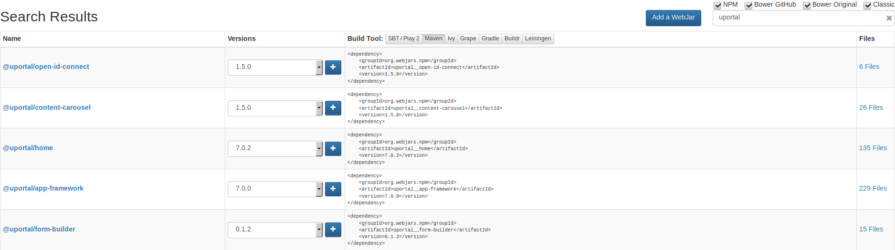
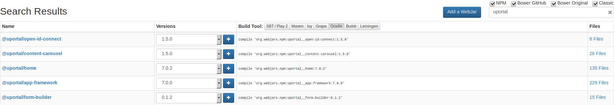

# WebJar

## What is a WebJar?

WebJars are client-side web libraries packaged into JAR files.

- Explicitly and easily manage the client-side dependencies in JVM-based web applications
- Use JVM-based build tools (e.g. Maven, Gradle, sbt, ...) to download your client-side dependencies
- Know which client-side dependencies you are using
- Transitive dependencies are automatically resolved and optionally loaded via RequireJS
- Deployed on Maven Central

## Use a WebJar with Maven

1. Visit <https://www.webjars.org>
2. Enter the package name into search
3. Select `Maven`
4. Copy the example snippet

## Use a WebJar with Gradle

1. Visit <https://www.webjars.org>
2. Enter the package name into search
3. Select `Gradle`
4. Copy the example snippet

## Create a WebJar from NPM

1. Visit <https://www.webjars.org>
2. Click add a WebJar 
3. Select a NPM package to add 
   - Select type `NPM`
   - Choose the package name
   - Choose the version to add

## Create a WebJar from a local directory

1. Build the project (usually `npm run build`)
2. Build a jar of the project `zip project.jar .`
3. Get the absolute path to the current folder `pwd`
4. Goto the maven project
5. `mvn install:install-file ${path from step 3}/project.jar`
